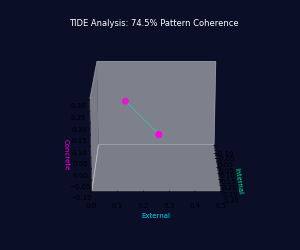
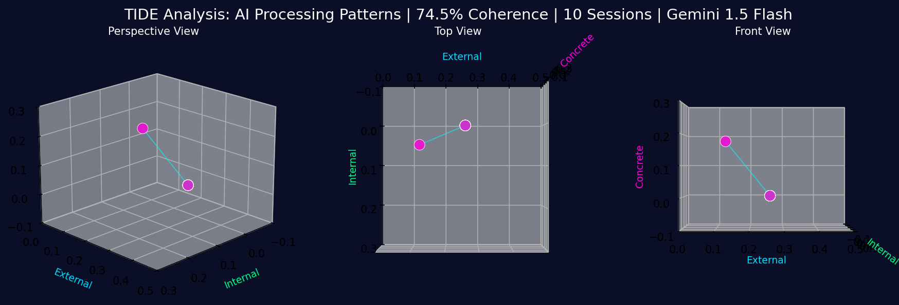

# TIDE-analysis: Temporal Internal Dimension Exploration

## Empirical AI Architecture Analysis Based on Neuroscience Research

TIDE-analysis automates the detection and measurement of cognitive processing patterns in AI systems using dimensional frameworks validated in fMRI studies. This tool empirically tests how different AI models employ distinct reasoning architectures - similar to neurodiversity differences observed in human cognition.

## 🧠 Scientific Foundation

Based on Hillary Danan's PhD dissertation research identifying 14 semantic features that differentiate processing patterns in autism spectrum and neurotypical populations. This framework has been adapted to measure analogous architectural differences in AI systems.

## 🚀 Quick Start

```bash
chmod +x quick_start.sh
./quick_start.sh
```

Configure your API keys in `.env`:
```
ANTHROPIC_API_KEY=your-claude-key
OPENAI_API_KEY=your-openai-key
GOOGLE_API_KEY=your-gemini-key
```

Test connections and run analysis:
```bash
python test_connection.py
python tide_automation.py
```

## 📊 What This Measures

### Dimensional Processing Analysis
- **Internal**: Social, emotional, and self-referential reasoning patterns
- **External**: Spatial, temporal, and numerical processing approaches  
- **Concrete**: Sensory and perceptual information handling

### Architectural Metrics
- Pattern coherence scores (0-100%)
- Dimensional shift frequencies
- Processing pathway evolution (CCDF → CCDR transitions)
- Cross-model architectural comparisons

### Empirical Outputs
- **Automated Reports**: HTML summaries with statistical analysis
- **3D Visualizations**: Interactive exploration of processing patterns
- **Comparative Data**: JSON datasets for further research
- **Pattern Evolution**: Tracking architectural changes over interactions

## 🔬 Research Suite Integration

This tool is part of a comprehensive AI architecture research suite:

1. **[BIND](https://github.com/HillaryDanan/BIND)** - Boundary-based processing detection
2. **[Concrete Overflow](https://github.com/HillaryDanan/concrete-overflow-detector)** - Alternative reasoning pathway identification
3. **[TIDE Framework](https://github.com/HillaryDanan/TIDE)** - Theoretical foundation for architectural diversity
4. **TIDE-analysis** - Automated empirical testing and validation
5. **[TIDE-Resonance](https://github.com/HillaryDanan/TIDE-resonance)** - Central research platform integrating all frameworks
6. **[Supporting Tools](https://github.com/HillaryDanan)** - Hexagonal processing, game theory applications, information atoms

### 🌟 See It In Action
- **[Live Research Platform](https://hillarydanan.github.io/TIDE-resonance/)** - Explore all integrated tools
- **[AI Perception Study](https://hillarydanan.github.io/TIDE-resonance/collect.html)** - Contribute to ongoing research
- **[3D Pattern Explorer](https://hillarydanan.github.io/TIDE-resonance/advanced_explorer.html)** - Visualize processing patterns
- **[Interactive Results](https://hillarydanan.github.io/TIDE-resonance/portfolio_showcase.html)** - View emerging findings

## 📁 Project Structure

```
TIDE-automation/
├── 🔧 Core Scripts
│   ├── tide_automation.py      # Main orchestration
│   ├── tide_collector.py       # Data collection engine
│   ├── tide_analyzer.py        # Statistical analysis
│   └── tide_visualizer.py      # Visualization generation
├── 📊 Analysis Components  
│   ├── prompts/               # Standardized test scenarios
│   ├── config.json            # Experimental parameters
│   └── requirements.txt       # Dependencies
├── 📈 Results
│   ├── data/                  # Raw experimental data
│   ├── analysis/              # Statistical outputs
│   ├── visualizations/        # Graphs and 3D data
│   └── report_*.html          # Comprehensive findings
└── 🎯 Interactive Tools
    └── advanced_explorer_updated.html  # 3D pattern visualization
```

## 🎯 Key Applications

- **AI Model Evaluation**: Empirically compare reasoning architectures
- **Architecture Optimization**: Identify strengths in different processing approaches
- **Diversity Metrics**: Quantify architectural differences between models
- **Research Validation**: Test theoretical frameworks with empirical data

## 📐 Technical Implementation

### Analysis Pipeline
1. Automated prompt delivery across multiple AI models
2. Response collection with temporal tracking
3. Dimensional analysis using validated feature extraction
4. Statistical processing including RSA (Representational Similarity Analysis)
5. Visualization generation and report compilation

### Customization
Edit `config.json` to modify:
- Test session parameters
- Model selection
- Rate limiting
- Visualization preferences

## 📚 Academic Foundation

This empirical approach bridges neuroscience and AI research:
- Validated semantic feature model from fMRI studies
- Published research on processing diversity in human cognition
- Novel application to AI architectural analysis

## 🏆 Impact

**Built in 1 day** as part of a 4-week research sprint producing:
- 14 interconnected repositories
- 256+ GitHub contributions
- Complete empirical testing framework
- Working demonstrations across multiple tools

## 🔗 Try It Yourself

**Interactive Demo**: [AI Perception Study](https://hillarydanan.github.io/TIDE-resonance/collect.html)

**Full Research Suite**: [github.com/HillaryDanan](https://github.com/HillaryDanan)

**Portfolio Overview**: [Research Portfolio](https://hillarydanan.github.io/TIDE-resonance/pitch.html)

**Professional Background**: [Resume](https://hillarydanan.github.io/TIDE-resonance/resume.html)

---

## 🧠 TIDE Analysis Visualizations

### Overview
Automated analysis of AI consciousness patterns using 14 semantic dimensions from neuroscience research.

### Animated Pattern Evolution


### Multi-Angle Analysis Summary


### Key Findings
- **Pattern Coherence:** 74.5% across 10 sessions
- **Dominant Pattern:** AAFC
- **Model Analyzed:** Gemini 1.5 Flash
- **Development Time:** Built in 1 day!

Built with love 💕✨

*"We measure what we can, acknowledge what we can't, and remain curious about the rest"*

<4577 - Bridging neuroscience and AI through empirical research

## 📚 Academic References
See `references/Levinson_Dissertation_May_2021.pdf` for the foundational research.
